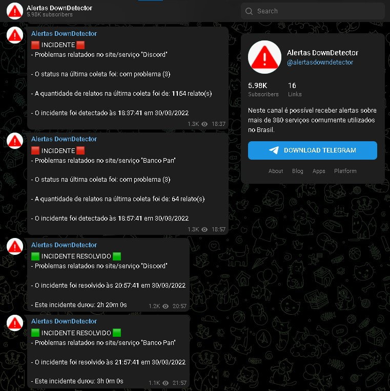

# Web Scraping Alertas Downdetector
Script de automação

## Sobre
O objetivo era desenvolver um script em `Python` utilizando a biblioteca `Beautiful Soup` que coletaria os status dos serviços online através de um canal no `Telegram` e enviaria os dados coletados por meio de `zabbix_sender` para o servidor `Zabbix`, que integrado ao `Grafana` apresentaria as informações de forma organizada.

Nesse repositório além do script, também estarei disponibilizando o `template do zabbix` e o `dashboard do grafana` utilizados no projeto.

### Versões usadas
```
ZABBIX  v6.0.2
GRAFANA v8.4.4
```

### Requisitos
```
apt-get install zabbix-sender / yum install zabbix-sender
apt-get install python3 / yum install python3
pip3 install requests
pip3 install subprocess.run
pip3 install beautifulsoup4
```

### Zabbix Sender

| Option | Description |
|-----------------|------------------------------------------------------------|
| -z | Zabbix server host (IP address can be used as well) |
| -s | technical name of monitored host (as registered in Zabbix frontend) |
| -k | item key |
| -o | value to send |

__Exemplo:__

`zabbix_sender -z 127.0.0.1 -s ZabbixSender -k downdetector.status.bancopan -o 1`

`zabbix_sender -z 127.0.0.1 -s ZabbixSender -k downdetector.hora.data.alelo -o 'UP 00:18:24 10/12/2020'`

0 -> INCIDENTE

1 -> INCIDENTE RESOLVIDO

### Crontab
- [Crontab Editor](https://crontab.guru/)
```
crontab -e
*/5 * * * * /usr/bin/python3 /root/web_scraping_alertas_downdetector.py (roda a cada 5 minutos)
chmod a+x web_scraping_alertas_downdetector.py
```

### Dashboard Grafana


__Canal Telegram onde os dados foram coletados:__

https://t.me/s/alertasdowndetector



### Créditos
__Desenvolvido por:__
```
Gabriel Aparecido Zucoloto
```
- [Linkedin](https://www.linkedin.com/in/gabriel-zucoloto-51a51b231)
- [Portfolio](https://bielzucoloto.github.io/)


